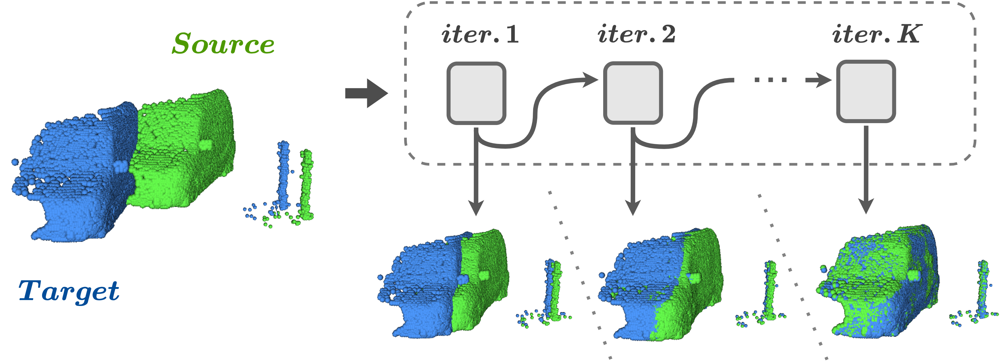

# FlowStep3D: Model Unrolling for Self-Supervised Scene Flow Estimation
The official pytorch implementation of [FlowStep3D: Model Unrolling for Self-Supervised Scene Flow Estimation](https://arxiv.org/pdf/2011.10147.pdf)
(Yair Kittenplon, Yonina C. Eldar, Dan Raviv, CVPR 2021).




## Citation
If you find this work useful, please cite our paper:
```
@article{Kittenplon2020FlowStep3DMU,
  title={FlowStep3D: Model Unrolling for Self-Supervised Scene Flow Estimation},
  author={Yair Kittenplon and Yonina C. Eldar and Dan Raviv},
  journal={ArXiv},
  year={2020},
  volume={abs/2011.10147}
}
```

## Installation  
This project implemented and tested on
* PyTorchLightning 0.9.0
* PyTorch 0.4.1  
* Python3.6  
* CUDA versions 10.1.243, 10.2.89
* Ubuntu 18.04

#### Create a virtual env and install requirements  
```
python3 -m venv venv
source venv/bin/activate
pip install -r requirements.txt  
```
#### Install PointNet2 CPP lib:
```
cd lib/pointnet2
python3 setup.py install
cd ../../
```

## Datasets

We follow [HPLFlowNet](https://github.com/laoreja/HPLFlowNet) preprocessing methods:

### Datasets path definition
```
SAVE_PATH=data/datasets
mkdir ${SAVE_PATH}
```
* for another SAVE_PATH, please change "train_data_root" in all configs/* yaml files accordingly

### FlyingThings3D
Download and unzip the "Disparity", "Disparity Occlusions", "Disparity change", "Optical flow", "Flow Occlusions" for DispNet/FlowNet2.0 dataset subsets from the [FlyingThings3D website](https://lmb.informatik.uni-freiburg.de/resources/datasets/SceneFlowDatasets.en.html) (we used the paths from [this file](https://lmb.informatik.uni-freiburg.de/data/FlyingThings3D_subset/FlyingThings3D_subset_all_download_paths.txt), now they added torrent downloads) . They will be upzipped into the same directory, RAW_DATA_PATH. Then run the following script for 3D reconstruction:
```
python data/preprocess/process_flyingthings3d_subset.py --raw_data_path RAW_DATA_PATH --save_path ${SAVE_PATH}/FlyingThings3D_subset_processed_35m --only_save_near_pts
```
### KITTI
Download and unzip [KITTI Scene Flow Evaluation 2015](http://www.cvlibs.net/download.php?file=data_scene_flow.zip) to directory RAW_DATA_PATH. Run the following script for 3D reconstruction:
```
python data/preprocess/process_kitti.py RAW_DATA_PATH ${SAVE_PATH}/KITTI_processed_occ_final
```

## Pretrained models
In order to download pre-trained models, please run:
```
bash scripts/download_models.sh
```

## Training

### Self-supervised training:
```bash
python run.py -c configs/train/flowstep3d_self_pre.yaml
# set pre_trained_weights_checkpoint in flowstep3d_self_ft.yaml according to checkpoint.
python run.py -c configs/train/flowstep3d_self_ft.yaml
```
### Fully-supervised training:
```bash
python run.py -c configs/train/flowstep3d_sv_pre.yaml
# set pre_trained_weights_checkpoint in flowstep3d_sv_ft.yaml according to checkpoint.
python run.py -c configs/train/flowstep3d_sv_ft.yaml
```

### Neptune logger
To activate logger, please create a user at [neptune.ai](https://neptune.ai/) and config "logging_params" at all config/train/*.yaml files accordingly.


## Inference
Self-supervised model:
```
python run.py -c configs/test/flowstep3d_self.yaml
```
Fully-supervised model:
```
python run.py -c configs/test/flowstep3d_sv.yaml
```

## Credits
In this project we use parts of the official implementations of the following libraries and repositories:
* [PyTorchLightning](https://github.com/PyTorchLightning/pytorch-lightning)
* [Pointnet2_PyTorch](https://github.com/sshaoshuai/Pointnet2.PyTorch)
* [flownet3d_Pytorch](https://github.com/hyangwinter/flownet3d_pytorch)
* [HPLFlowNet](https://github.com/laoreja/HPLFlowNet)
* [FLOT](https://github.com/valeoai/FLOT)
